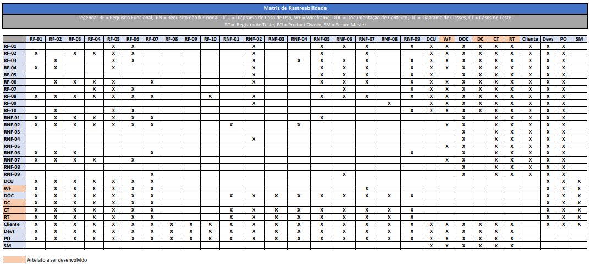

# Especificações do Projeto

**Pré-requisitos:** [Documentação de Contexto](1-Documentação de Contexto.md)

## Personas

### João Silva

João Silva tem 35 anos, é um empreendedor que administra sua própria empresa de consultoria financeira. Ele precisa de uma solução que o ajude a gerenciar suas finanças de forma eficiente e segura, incluindo despesas pessoais e relacionadas à empresa.

### MARIA SANTOS 
Maria Santos é uma estudante universitária de 22 anos que está lutando para gerenciar suas finanças pessoais enquanto cursa a faculdade. Ela precisa de uma solução que a ajude a controlar seus gastos, acompanhar suas despesas com educação e manter um orçamento equilibrado, tudo isso enquanto equilibra os estudos e o trabalho de meio período.

### PEDRO OLIVEIRA 
Pedro Oliveira é um profissional autônomo de 40 anos que trabalha como freelancer na área de design gráfico. Ele precisa de uma solução que o auxilie a acompanhar seus projetos em andamento, gerenciar suas despesas comerciais, como aquisição de softwares e equipamentos, e controlar suas finanças pessoais, garantindo que ele possa manter suas contas em dia e economizar para o futuro.
## Histórias de Usuários

| EU COMO... | QUERO/PRECISO... | PARA... |
|------------|-------------------|---------|
| joão Silva. | Registrar despesas. | Manter um registro das transações financeiras. |
| João Silva. | Gerar relatórios financeiros. | Analisar o desempenho financeiro.  |
| Maria Santos. | Controle de despesas. | Controlar o périodo de tempo em que mais teve consumo.|
| Maria Santos. | Conhecer as catergias com que mais tem gastado. | Analisar seu consumo de materias de uma mesma categoria. |
| Pedro Oliveira. | Rastrear seu consumo. | Analisar seus principais consumos. |

## Modelagem do Processo de Negócio

### Análise da Situação Atual

Atualmente, as despesas são registradas manualmente em planilhas eletrônicas, o que torna difícil acompanhar todas as transações.

### Descrição Geral da Proposta

A proposta é desenvolver uma aplicação web e mobile que permita aos usuários registrar e gerenciar suas despesas de forma eficiente e segura.

### Processo 1 – Registro de Despesas

Este processo envolve o registro de despesas no sistema.

### Processo 2 – Geração de Relatórios Financeiros

Este processo envolve a geração de relatórios financeiros para análise.

## Tabelas do Banco de Dados

### Requisito
### Despesa

| Campo | Tipo | Descrição |
|-------|------|-----------|
| ID    | Int  | Identificador único da despesa |
| Valor | Decimal | Valor da despesa |
| Data  | Date | Data da despesa |
| Categoria | Varchar | Categoria da despesa |
| Descrição | Text | Descrição detalhada da despesa |

## Requisitos Funcionais (RF)

| ID    | Descrição do Requisito                      | Prioridade |
|-------|---------------------------------------------|------------|
| RF-001| Permitir o registro de despesas             | Alta       |
| RF-002| Possibilitar a geração de relatórios financeiros | Alta |
| RF-003| Permitir o cadastro de categorias de despesas | Média   |
| RF-004| Implementar autenticação de usuários        | Alta       |
| RF-005| Garantir o armazenamento seguro das senhas  | Alta       |

## Requisitos Não Funcionais (RNF)

| ID    | Descrição do Requisito                                       | Prioridade |
|-------|--------------------------------------------------------------|------------|
| RNF-001| O sistema deve ser responsivo e compatível com dispositivos móveis | Alta |
| RNF-002| Garantir que a aplicação seja intuitiva e fácil de usar     | Média      |
| RNF-003| As transações financeiras devem ser processadas em tempo real | Alta    |
| RNF-004| O sistema deve ser compatível com múltiplos navegadores     | Alta      |

# Diagrama de Casos de Uso

## Caso de Uso: Registra Despesas

### Descrição:
O usuário registra suas despesas no sistema.

### Ator Primário:
Usuário

### Fluxo Principal:
1. O usuário acessa a função de registro de despesas.
2. O sistema exibe o formulário de registro de despesas.
3. O usuário preenche as informações necessárias (valor, categoria, data, descrição, etc.).
4. O usuário confirma o registro da despesa.
5. O sistema armazena a despesa no banco de dados.

## Caso de Uso: Gera Relatórios Financeiros

### Descrição:
O usuário gera relatórios financeiros para análise.

### Ator Primário:
Usuário

### Fluxo Principal:
1. O usuário acessa a função de geração de relatórios.
2. O sistema exibe opções para escolher o tipo de relatório desejado (por período, por categoria, etc.).
3. O usuário seleciona as opções desejadas.
4. O sistema gera o relatório conforme as seleções do usuário.
5. O sistema exibe o relatório para o usuário.

# Matriz de Rastreabilidade

# Gerenciamento de Projeto

## Gerenciamento de Tempo

Para o gerenciamento de tempo, utilizaremos o diagrama de Gantt para visualizar as tarefas e seu cronograma:

## Gerenciamento de Equipe

O gerenciamento de equipe será feito por meio de uma ferramenta de gestão de tarefas, que permitirá atribuir atividades aos membros da equipe e acompanhar seu progresso.

## Gestão de Orçamento

A gestão de orçamento será realizada considerando os recursos financeiros disponíveis e os custos estimados para cada fase do projeto.
