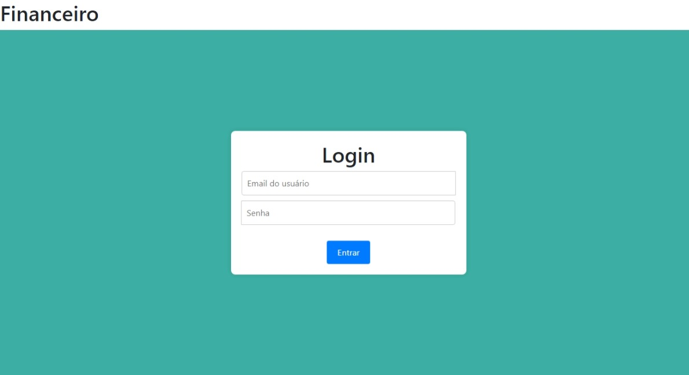
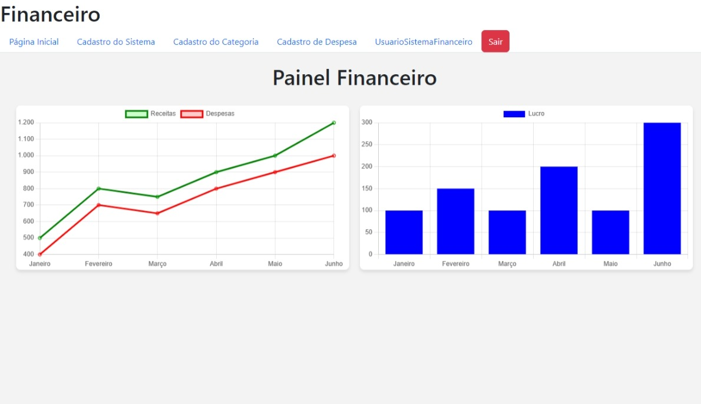
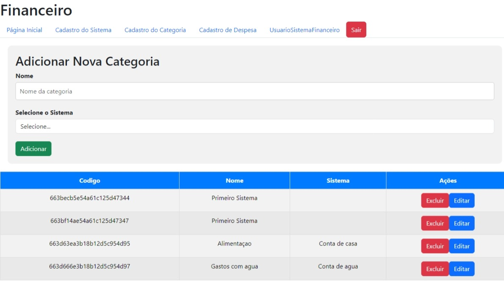
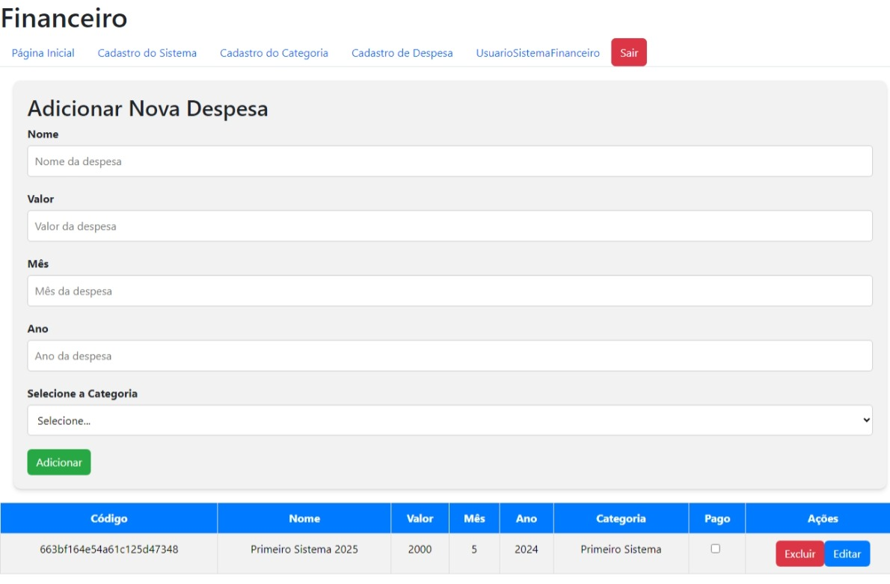
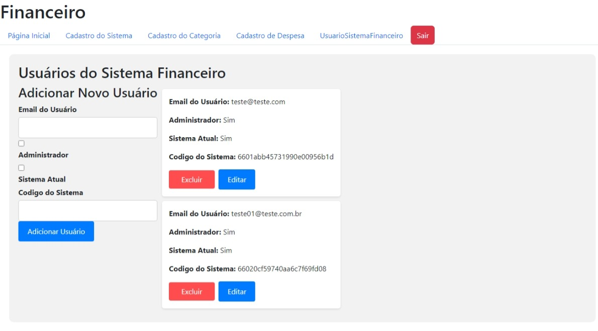
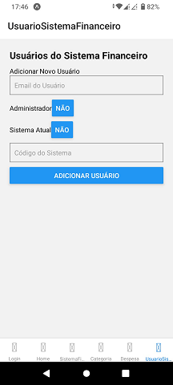

# Projeto de Interface

Nesta seção, apresentaremos a visão geral da interação do usuário pelas telas do sistema e o protótipo interativo das telas com as funcionalidades que fazem parte do sistema (wireframes).

## Diagrama de Fluxo

## Wireframes

Os wireframes são protótipos usados em design de interface para sugerir a estrutura de um site web e seus relacionamentos entre suas páginas. Um wireframe web é uma ilustração semelhante do layout de elementos fundamentais na interface.

### Projeto Web
### Tela de Login

### Dashboard Principal

### Tela do Sistema

### Tela Categoria do Sistema

### Tela Despesa do Sistema

### Tela Usuario do Sistema

### Projeto Mobile
### Tela de Login

### Dashboard Principal

### Tela do Sistema

### Tela Categoria do Sistema

### Tela Despesa do Sistema

### Tela Usuario do Sistema

