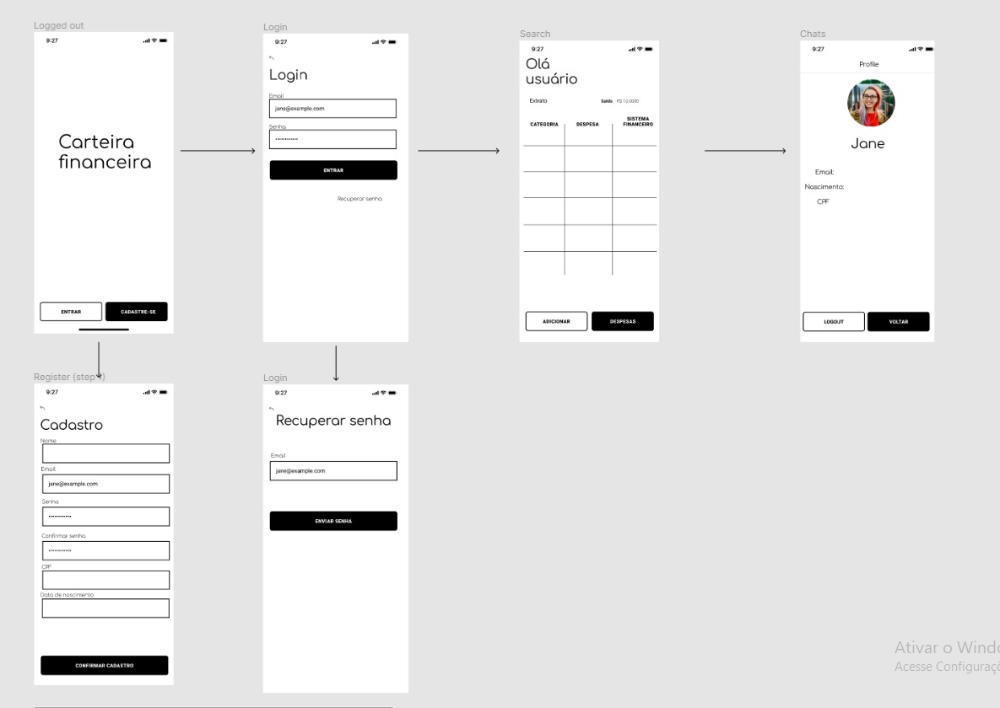

# Projeto de Interface

Pré-requisitos: <a href="2-Especificação do Projeto.md"> Documentação de Especificação</a>

Nesta seção, apresentaremos a visão geral da interação do usuário pelas telas do sistema e o protótipo interativo das telas com as funcionalidades que fazem parte do sistema (wireframes).

## Diagrama de Fluxo

## Wireframes

Os wireframes são protótipos usados em design de interface para sugerir a estrutura de um site web e seus relacionamentos entre suas páginas. Um wireframe web é uma ilustração semelhante do layout de elementos fundamentais na interface.

### Tela inicial

### Tela de Login

### Tela de recuperação de tela 

### Tela de cadastro

### Dashboard Principal

### PROFILE 

