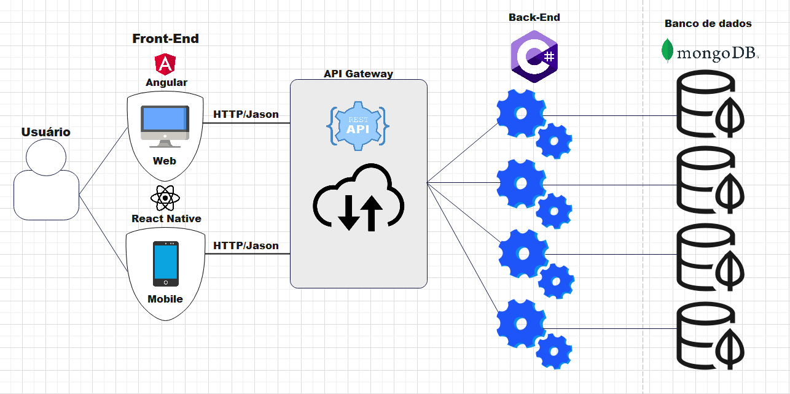

# Arquitetura da Solução

## Introdução

Nesta seção, vamos descrever a arquitetura da solução para o sistema financeiro, incluindo os principais componentes do sistema, as tecnologias utilizadas, o ambiente de hospedagem e as diretrizes de qualidade de software.

## Componentes da Solução

O sistema financeiro será composto pelos seguintes componentes:

- **Frontend Web**: Interface de usuário acessível por navegadores web. Desenvolvido utilizando Angular.
- **Frontend Mobile**: Interface de usuário acessível por dispositivos móveis. Desenvolvido utilizando React Native.
- **Backend API**: Responsável por fornecer os dados para o frontend e executar a lógica de negócios. Desenvolvido em C# utilizando ASP.NET Core.
- **Banco de Dados**: Armazenará os dados do sistema. Utilizaremos o MongoDB, um banco de dados NoSQL.
 

 ## Arquitetura Distribuida
A arquitetura distribuída adotada para o sistema financeiro permite que cada microsserviço, como Categoria, Despesa, FormaPagamento e Usuário, seja desenvolvido, implantado e escalado independentemente. Essa abordagem facilita a manutenção e a evolução contínua do sistema. A ApiGateway atua como uma camada de abstração entre os clientes e os microsserviços, simplificando o acesso aos recursos e garantindo a segurança e o controle das solicitações. Além disso, cada microsserviço possui seu próprio banco de dados, garantindo a segregação de dados e permitindo uma melhor escalabilidade e desempenho.

 

## Qualidade de Software

Considerando as diretrizes da norma ISO/IEC 25010, nossa equipe selecionou as seguintes subcaracterísticas de qualidade para nortear o desenvolvimento do projeto do sistema financeiro:

1. **Confiabilidade**:
   - Métricas: Taxa de falhas, tempo médio entre falhas.

2. **Manutenibilidade**:
   - Métricas: Tempo médio para correção de bugs, facilidade de extensão do código.

3. **Desempenho**:
   - Métricas: Tempo de resposta da API, tempo de carregamento das páginas web e mobile.

4. **Usabilidade**:
   - Métricas: Tempo de aprendizado do usuário, taxa de conclusão de tarefas.

5. **Segurança**:
   - Métricas: Nível de vulnerabilidades identificadas, tempo médio para correção de vulnerabilidades.
     

## Diagrama de Classes

## Modelo ER

Entidades:
- Categoria
- Despesa
- FormaPagamento
- Usuario

Relacionamentos:
- Uma Categoria está associada a Despesa.
- Uma Despesa pertence a uma Categoria.
- Uma Categoria é associada a uma FormaPagamento.
- FormaPagamento está associada a despesa.

## Esquema Relacional

Tabelas:
- Categoria (Id, Nome)
- Despesa (Id, Nome, Valor, DataCompra, DataVencimento, StatusPago, FormaPagamendoId, CategoriaId)
- FormaPagamento (Id, Nome, Descricao)
- Usuario (Id, Nome, Email, Senha,)

## Tecnologias Utilizadas

Para resolver o problema e implementar a solução do sistema financeiro, utilizaremos as seguintes tecnologias:

- Linguagens: C# para a API, Script para o frontend web e mobile.
- Banco de Dados: MongoDB (NoSQL).
- Frameworks: ASP.NET Core 8.0 para a API, Angular para o frontend web, React Native para o frontend mobile.
- IDEs: Visual Studio para desenvolvimento em C#, Visual Studio Code para desenvolvimento em Script.
- Ferramentas de versionamento: Git e GitHub.

## Hospedagem

A API Gateway está hospedada em um servidor privado (WindowsServer, rodando via IIS) na nuvem, no endereço: "[apigateway.criadoresdesoftware.com.br:5000](https://apigateway.criadoresdesoftware.com.br:5000)".

## Considerações Finais

A arquitetura da solução foi cuidadosamente planejada para atender às necessidades do sistema financeiro, garantindo um alto padrão de qualidade, desempenho e segurança. A utilização de tecnologias modernas e práticas recomendadas garantirá a eficiência e escalabilidade do sistema.

