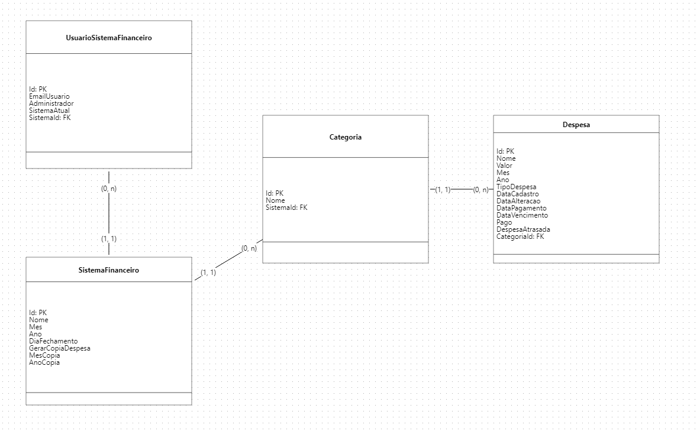

# Arquitetura da Solução

## Introdução

Nesta seção, vamos descrever a arquitetura da solução para o sistema financeiro, incluindo os principais componentes do sistema, as tecnologias utilizadas, o ambiente de hospedagem e as diretrizes de qualidade de software.

## Componentes da Solução

O sistema financeiro será composto pelos seguintes componentes:

- **Frontend Web**: Interface de usuário acessível por navegadores web. Desenvolvido utilizando React.js.
- **Frontend Mobile**: Interface de usuário acessível por dispositivos móveis. Desenvolvido utilizando React Native.
- **Backend API**: Responsável por fornecer os dados para o frontend e executar a lógica de negócios. Desenvolvido em C# utilizando ASP.NET Core.
- **Banco de Dados**: Armazenará os dados do sistema. Utilizaremos o MongoDB, um banco de dados NoSQL.

## Tecnologias Utilizadas

- **Linguagens**: C# para a API, JavaScript para o frontend (web e mobile).
- **Frameworks**: ASP.NET Core para o backend, React para o frontend web, React Native para o frontend mobile.
- **Banco de Dados**: MongoDB, MySQL
- **Ferramentas de Desenvolvimento**: Visual Studio para C#, Visual Studio Code para JavaScript.
- **Ferramentas de Versionamento**: Git e GitHub.
- 
- 

 ## Refatoração

Com a necessidade de se introduzir no projeto o teste de unidade, descobriu-se que a arquitetura utilizada é inadequada para tal (ver Plano de Testes de Software).

Assim, tornou-se necessária a refatoração do código para o padrão de projeto Repositório, incluindo uma camada entre o bando de dados e o modelo de negócios.

O novo esquema pode ser visto abaixo:

## Hospedagem

A aplicação será hospedada em um servidor na nuvem, como o Azure para a API e o GitHub Pages para o frontend web.

## Qualidade de Software

Considerando as diretrizes da norma ISO/IEC 25010, nossa equipe selecionou as seguintes subcaracterísticas de qualidade para nortear o desenvolvimento do projeto do sistema financeiro:

1. **Confiabilidade**:
   - Métricas: Taxa de falhas, tempo médio entre falhas.

2. **Manutenibilidade**:
   - Métricas: Tempo médio para correção de bugs, facilidade de extensão do código.

3. **Desempenho**:
   - Métricas: Tempo de resposta da API, tempo de carregamento das páginas web e mobile.

4. **Usabilidade**:
   - Métricas: Tempo de aprendizado do usuário, taxa de conclusão de tarefas.

5. **Segurança**:
   - Métricas: Nível de vulnerabilidades identificadas, tempo médio para correção de vulnerabilidades.
   - 
## Considerações Finais

A arquitetura da solução foi cuidadosamente planejada para atender às necessidades do sistema financeiro, garantindo um alto padrão de qualidade, desempenho e segurança. A utilização de tecnologias modernas e práticas recomendadas garantirá a eficiência e escalabilidade do sistema.

## Diagrama de Classes

## Modelo ER

Entidades:
- Despesa
- Categoria
- SistemaFinanceiro
- UsuarioSistemaFinanceiro

Relacionamentos:
- Uma Despesa pertence a uma Categoria
- Uma Categoria é associada a um SistemaFinanceiro
- Um UsuarioSistemaFinanceiro é associado a um SistemaFinanceiro

## Esquema Relacional

Tabelas:
- Despesa (Id, Nome, Valor, Mes, Ano, TipoDespesa, DataCadastro, DataAlteracao, DataPagamento, DataVencimento, Pago, DespesaAtrasada, CategoriaId)
- Categoria (Id, Nome, SistemaId)
- SistemaFinanceiro (Id, Nome, Mes, Ano, DiaFechamento, GerarCopiaDespesa, MesCopia, AnoCopia)
- UsuarioSistemaFinanceiro (Id, EmailUsuario, Administrador, SistemaAtual, SistemaId)

## Modelo Físico

Arquivo banco.sql contendo os scripts de criação das tabelas do banco de dados que consta na pasta src\bd

[Arquivo banco.sql](../src/bd/banco.sql)

## Tecnologias Utilizadas

Para resolver o problema e implementar a solução do sistema financeiro, utilizaremos as seguintes tecnologias:

- Linguagens: C# para a API, JavaScript para o frontend web e mobile.
- Banco de Dados: MongoDB (NoSQL).
- Frameworks: ASP.NET Core para a API, React para o frontend web, React Native para o frontend mobile.
- IDEs: Visual Studio para desenvolvimento em C#, Visual Studio Code para desenvolvimento em JavaScript.
- Ferramentas de versionamento: Git e GitHub.

## Hospedagem

A aplicação será hospedada em um servidor na nuvem, como o Heroku para a API e o GitHub Pages para o frontend web.

## Qualidade de Software

Considerando as diretrizes da norma ISO/IEC 25010, nossa equipe selecionou as seguintes subcaracterísticas de qualidade para nortear o desenvolvimento do projeto do sistema financeiro:

1. **Confiabilidade**:
   - Métricas: Taxa de falhas, tempo médio entre falhas.

2. **Manutenibilidade**:
   - Métricas: Tempo médio para correção de bugs, facilidade de extensão do código.

3. **Desempenho**:
   - Métricas: Tempo de resposta da API, tempo de carregamento das páginas web e mobile.

4. **Usabilidade**:
   - Métricas: Tempo de aprendizado do usuário, taxa de conclusão de tarefas.

5. **Segurança**:
   - Métricas: Nível de vulnerabilidades identificadas, tempo médio para correção de vulnerabilidades.

