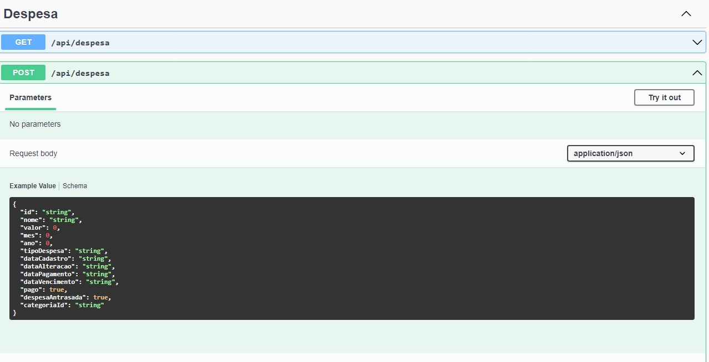
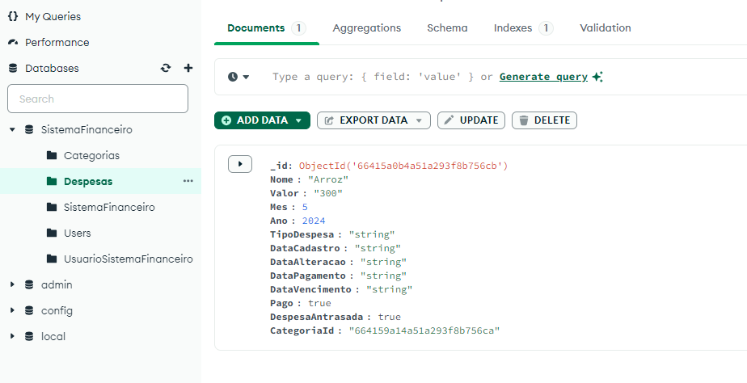

## Descrição do Projeto

Este projeto consiste em um sistema financeiro desenvolvido em ASP.NET Core, utilizando MongoDB como banco de dados. O sistema permite que os usuários cadastrem suas despesas, gerenciem categorias e visualizem relatórios detalhados das despesas cadastradas.

### Funcionalidades Implementadas

#### Cadastro de Usuários
- Permite que novos usuários se cadastrem no sistema financeiro.
- Página de cadastro de usuários: `cadastro_usuario.html`
- Script para validar e enviar dados do formulário de cadastro de usuários: `cadastro_usuario.js`
- Estrutura de dados: Tabela `usuarios` no banco de dados

#### Login de Usuários
- Permite que usuários cadastrados façam login no sistema financeiro.
- Página de login: `login.html`
- Script para validar e enviar dados do formulário de login: `login.js`
- Estrutura de dados: Tabela `usuarios` no banco de dados

#### Samuel - Tela de despesa
- Permite que os usuários cadastrem suas despesas no sistema financeiro.
- Página de cadastro de despesas: `cadastro_despesa.html`
- Script para validar e enviar dados do formulário de cadastro de despesas: `cadastro_despesa.js`
- Estrutura de dados: Tabela `despesas` no banco de dados
- 
- # Captura de Tela do Swagger
O Swagger é uma ferramenta utilizada para documentar e testar APIs RESTful. Abaixo está uma captura de tela do Swagger para este projeto, mostrando as rotas disponíveis e os parâmetros necessários para cada operação:

-  
-  
-
-  O banco de dados MongoDB foi estruturado para armazenar informações sobre despesas. Cada documento na coleção "Despesas" contém os seguintes campos:
-  
- 
- 
  # Vídeo da explicação da atividade está disponibilizado no YouTube:

  - Video etapa 2: https://youtu.be/oc-NHYFxGlI - Projeto Back End com MongoDb
  - Video etapa 3: https://youtu.be/9lc6o-Mj3PM - Projeto Front End Web
  - Video etapa 4: https://youtu.be/SIq9oDMEK_Y - Projeto Front End Mobile React Native

#### Visualização de Relatórios de Despesas
- Permite que os usuários visualizem relatórios detalhados de suas despesas cadastradas no sistema financeiro.
- Página de visualização de relatórios de despesas: `relatorios_despesas.html`
- Script para recuperar e exibir os dados das despesas cadastradas: `relatorios_despesas.js`
- Estrutura de dados: Tabela `despesas` no banco de dados

#### Nicolas - Cadastro de Categorias
- Permite que os usuários cadastrem categorias para classificar suas despesas.
- Controller para manipulação das categorias: `SistemaFinanceiroController.cs`
- Estrutura de dados: Tabela `categorias` no banco de dados

Vídeo da explicação da atividade está disponibilizado no YouTube:
 
 - Vídeo etapa 2: https://youtu.be/qLx-NG-Mda8 - Projeto Back End com MongoDB
 
 - Vídeo etapa 2: https://youtu.be/S-ELnjHA54w  - teste tabela Sistema Financeiro - Lucas

 - Vídeo etapa 2: https://youtu.be/zNdhYoLdm6M - Teste Usuário Sistema Financeiro - Frederico
 
 - Vídeo etapa 2: https://youtu.be/on_2YBkPEiw - Teste Categorias Sistema Financeiro - Nicolas

### Como Utilizar o Projeto

1. Clone este repositório para o seu ambiente de desenvolvimento.
2. Certifique-se de ter o ambiente de desenvolvimento ASP.NET Core configurado.
3. Configure as credenciais do banco de dados MongoDB no arquivo `appsettings.json`.
4. Execute o projeto e acesse as diferentes funcionalidades através das páginas HTML fornecidas.

### Considerações Finais

Este projeto serve como uma base para o desenvolvimento de um sistema financeiro mais completo e pode ser expandido com novas funcionalidades e melhorias de acordo com as necessidades do usuário. Certifique-se de revisar e ajustar o código e os artefatos de acordo com os requisitos específicos do seu projeto.
