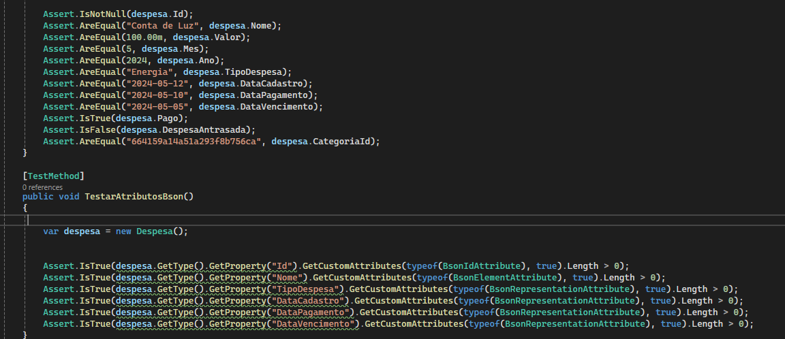

# Registro de Testes de Software

## Avaliação

Durante os testes de software realizados no sistema, foram identificados diversos pontos fortes e fracos na solução. Abaixo estão os principais destaques:

### Pontos Fortes:
1. **Funcionalidade de Login:** O processo de login na aplicação se mostrou eficiente e confiável, autenticando os usuários corretamente.
2. **Cadastro de Usuário:** O cadastro de novos usuários foi realizado sem problemas, e as informações foram corretamente armazenadas no sistema.

3. **Teste de Mapeamento da Despesa:**

Neste teste, verificamos se a instância da classe Despesa é corretamente mapeada com os valores esperados. São avaliados atributos como identificador, nome, valor, tipo de despesa, datas de cadastro, pagamento e vencimento, além de flag de pagamento e atraso, e o identificador da categoria.

Teste de Atributos Bson:

Neste segundo teste, confirmamos se os atributos da classe Despesa estão corretamente decorados com os atributos Bson necessários para a serialização correta no MongoDB. Verificamos a presença dos atributos BsonId para o identificador, BsonElement para nome e tipo de despesa, e BsonRepresentation para as datas de cadastro, pagamento e vencimento.

### Pontos Fracos:
1. **Validação de Campos:** Foi identificada uma falha na validação dos campos durante o cadastro de usuário, permitindo que campos obrigatórios fossem deixados em branco.
2. **Resiliência a Falhas:** Em alguns casos, a aplicação não lidou adequadamente com falhas de conexão ou erros de servidor, resultando em experiências negativas para o usuário.

## Estratégias de Melhoria:
Para abordar os pontos fracos identificados durante os testes, o grupo pretende implementar as seguintes estratégias nas próximas iterações do desenvolvimento:
1. **Melhoria na Validação de Campos:** Será implementada uma validação mais robusta dos campos durante o cadastro de usuário, garantindo que todos os campos obrigatórios sejam preenchidos antes do envio do formulário.
2. **Aprimoramento da Resiliência a Falhas:** Serão realizadas melhorias na lógica de tratamento de erros da aplicação, implementando mecanismos para lidar adequadamente com falhas de conexão e erros de servidor, garantindo uma experiência mais consistente para o usuário.

Com base nos resultados obtidos nos testes, o grupo está confiante de que as melhorias propostas contribuirão significativamente para a qualidade e robustez da solução.
